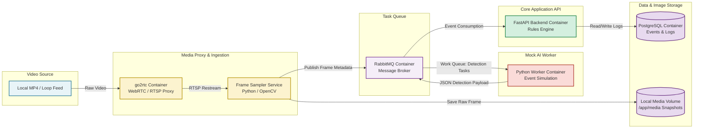
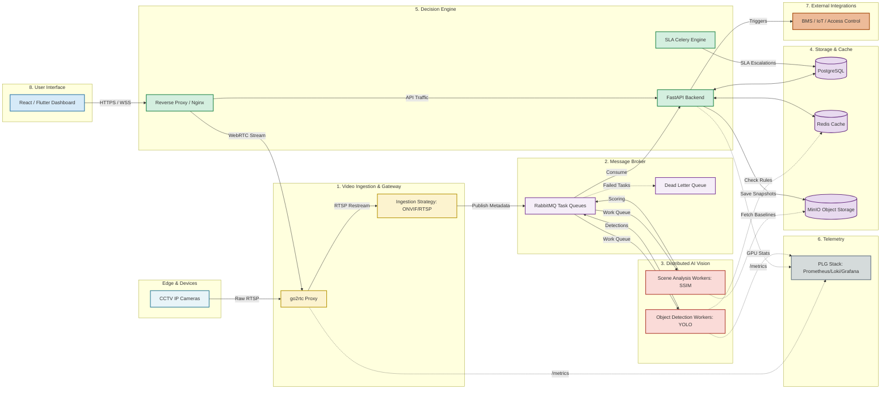

# AI Facility Monitoring Platform - Infrastructure PoC

## Overview
This repository contains the Proof of Concept (PoC) for an AI-powered Computer Vision platform designed for intelligent building monitoring and facility operational analytics. 

This initial build focuses entirely on **infrastructure resilience, data decoupling, and real-time processing pipelines** rather than final model accuracy. It provides a scalable, containerized foundation structured to allow a team of engineers to work in parallel across frontend, AI, and DevOps tasks without infrastructure bottlenecks. 

Please feel free to reuse, fork, or adapt this architecture for enterprise facility management pipelines.

---
## Demo

https://github.com/user-attachments/assets/1c424474-a43a-470e-a051-d2f6675f5a24

---
## The "Why": Architecture & DevOps Strategy
Processing multiple live video feeds through deep learning models (like YOLO) is computationally heavy. A standard monolithic application would quickly suffer from buffering, dropped frames, and memory leaks. This architecture solves those physical constraints through three core principles:

1. **Edge Gateway Proxying:** By using `go2rtc` as the singular entry point, physical IP cameras are shielded from multiple client connections. It transcodes RTSP to WebRTC on the fly for sub-second frontend latency without burdening the client's browser.
2. **Event-Driven Decoupling:** AI inference is entirely detached from video ingestion. An ingestion worker samples frames and pushes them to a RabbitMQ task queue. This allows multiple AI workers to process frames at their own pace without bottlenecking the live stream.
3. **Hardware Simulation:** To ensure development stability and portability, this PoC uses a local video loop to simulate a 24/7 RTSP camera feed. This removes the dependency on external network conditions or physical hardware during the initial development phase.

---

## Phase 1: MVP System Architecture (Current Build)

The following diagram illustrates the data flow and container boundaries of the current PoC. It strips away secondary infrastructure to focus strictly on video ingestion, AI detection simulation, event routing, and storage.



---

## Phase 2: Enterprise-Ready Vision (Target Architecture)

As the project scales to support production-level facility management, the MVP is designed to seamlessly evolve into the following enterprise architecture. This integrates advanced state caching, object storage, SLA scheduling, and a full observability stack.



### Key Enterprise Upgrades:

* **Redis Caching:** AI workers read execution rules directly from memory rather than hitting PostgreSQL on every frame, eliminating database thread contention.
* **MinIO Object Storage:** Replaces the local volume mount with an S3-compatible, distributed storage layer for raw event images and baseline reference models.
* **Dead Letter Queue (DLQ):** Protects the pipeline by automatically routing corrupted "poison pill" frames away from the main inference workers to prevent crashes.
* **PLG Observability:** Integrates Prometheus, Loki, and Grafana to track SLA compliance, GPU temperatures, queue lag, and API response times.

---

## Repository Structure

* `docker-compose.yml`: The core orchestrator. Defines the network, volumes, and 4 primary services (`go2rtc`, `rabbitmq`, `postgres`, `backend`, `ai_worker`).
* `test_video/`: Contains the `sample.mp4` file used by `go2rtc` to generate the local simulated RTSP stream.
* `media/`: A shared Docker volume mapped to the host. The AI worker saves event snapshots here, which the backend can serve or reference.
* `config/init.sql`: The initialization script that automatically generates the relational schema in PostgreSQL on the first boot.
* `backend/`: Contains the FastAPI application (`main.py`) and its `Dockerfile`. This service listens to the message broker and writes validated alerts to the database.
* `ai_worker/`: Contains the OpenCV ingestion and mock AI script (`worker.py`). It captures frames from the proxy, saves them, and publishes simulated JSON detections to RabbitMQ.

---

## Quick Start Guide

**Prerequisites:** Docker and Docker Compose installed (tested on Docker Desktop with WSL2 backend).

1. Clone the repository to your local machine.
2. Place a short testing video named `sample.mp4` inside the `test_video/` directory.
3. Build and launch the container stack:
```bash
docker compose up -d --build

```


4. **Verify the Services:**
* **RabbitMQ Dashboard:** Navigate to `http://localhost:15672` (Credentials: `guest` / `guest`)
* **go2rtc WebRTC Stream:** Navigate to `http://localhost:1984` to view the live video loop.
* **FastAPI Swagger Docs:** Navigate to `http://localhost:8000/docs` to view and interact with the REST API.


5. The `ai_worker` will automatically begin processing the video loop and publishing simulated alert payloads to the database. You can view these processed events via the `/events` API endpoint.

---

## Injecting Custom AI Models

The `ai_worker` directory is designed to be highly modular. To replace the simulation script with a live PyTorch or YOLO model:

1. Update the `ai_worker/requirements.txt` to include `ultralytics`, `torch`, or your framework of choice.
2. Modify `worker.py` to load your pre-trained `.pt` weights.
3. Instead of randomly generating the `event_type` and `confidence`, map these directly to your model's output classes and bounding box confidence scores.
4. The JSON payload contract expected by the backend remains identical:
```json
{
    "camera_id": "test_cam_01",
    "event_type": "occupancy_detected",
    "confidence": 0.89,
    "image_path": "/media/occupancy_detected_20260810_153000.jpg"
}

```
---
## Notes
### Architecture Mapping Note
* In this MVP PoC, the **Frame Sampler Service** and the **AI Event Simulator** are combined inside the `ai_worker` container (`ai_worker/worker.py`) using Python and OpenCV (`cv2.VideoCapture`). 
* In production deployment (Phase 2), frame ingestion and AI inference split into separate microservices so heavy model execution never causes frame sampling lag.


### Message Contract (RabbitMQ Payload)

The `ai_worker` publishes JSON event payloads to the `ai_alerts` queue using the following schema:

```json
{
  "camera_id": "test_cam_01",
  "event_type": "spill_detected",
  "confidence": 0.92,
  "image_path": "/media/spill_detected_20260810_193000.jpg"
}
```
This decoupled schema allows backend services, external BMS platforms, or real-time alert UI components to consume alerts without needing direct access to the computer vision layer.

### Troubleshooting

* **Container Health Checks:** PostgreSQL and RabbitMQ include built-in health checks. The `backend` container will wait for both services to be fully healthy before starting.
* **Missing Video File:** If `go2rtc` fails to start, ensure a valid video file exists at `test_video/sample.mp4`.
* **Database Logs:** To inspect events recorded in PostgreSQL directly from your host terminal:
  ```bash
  docker exec -it postgres psql -U admin -d facility_events -c "SELECT * FROM facility_events;"
